# NotesList
Приложение для заметок и списка дел.

## Возможности приложения
* Создание списка заметок.
* Создание списка дел.
* Возможность личных настроек приложения: 
* - выбор стиля заметок
* - выбор формата времени
* - возможность удаления всех заметок из приложения
* - выбор темы приложения
* - выбор размера шрифта заголовка
* - выбор размера шрифта заметки
* Возможность выделять текст в заметке разными цветами.
* Возможность выделять текст в заметке жирными шрифтом.
* Запись заметок в базу данных.
* Создание словаря, запоминание уже внесенных дел и подсказки при внесении текста.
* Возможность отметить выполненные дела с помощью чекбокса.
* Счетчик выполненных и суммарного количества дел в заметке.
* Возможность поделиться списком.

## Технологический стек
* MVVM
* Room
* Viewbinding
* ColorPicker

## Минимальные требования
* Поддержка Android 5.0+
* Поддержка смартфонов
* Поддержка портретной ориентации
* Приложение должно быть реализовано с рекомендациями Material Design
* targetSdk=30 или выше
* Kotlin

## Скриншоты
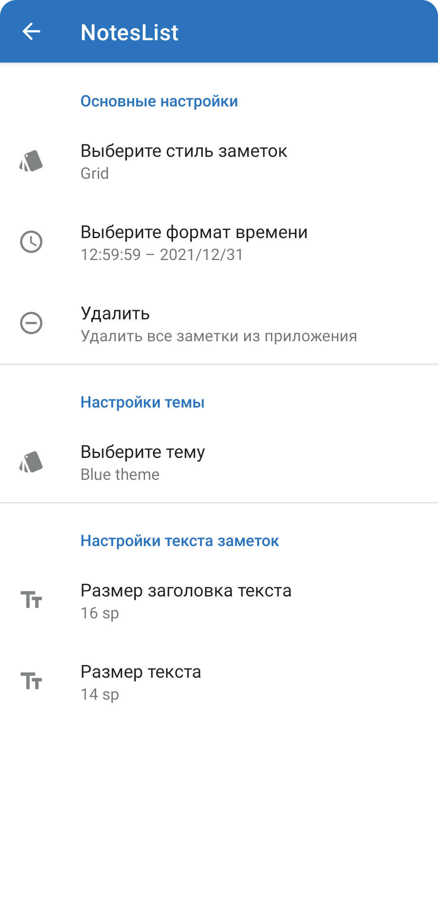        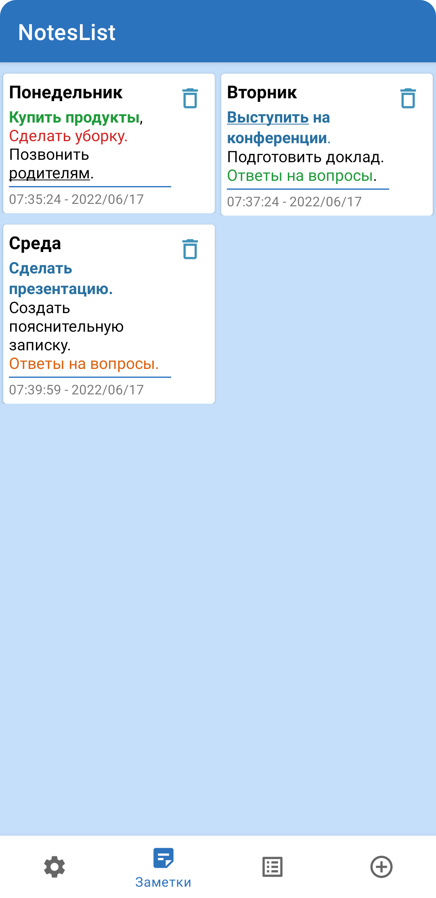  
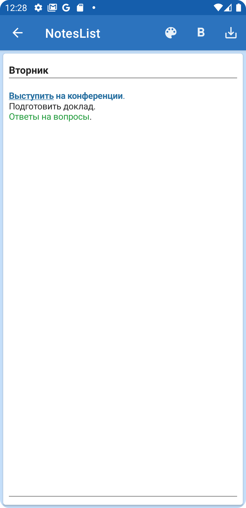        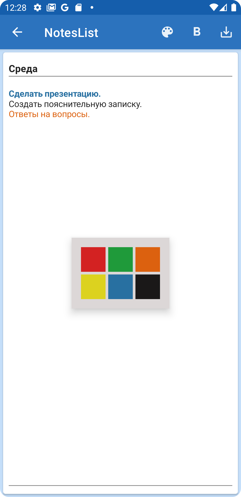 
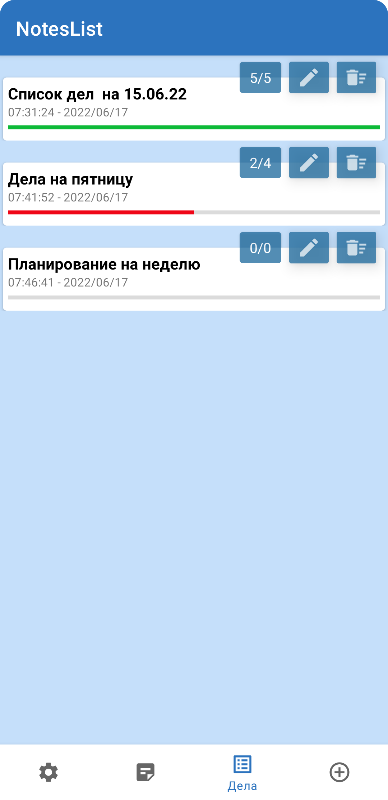        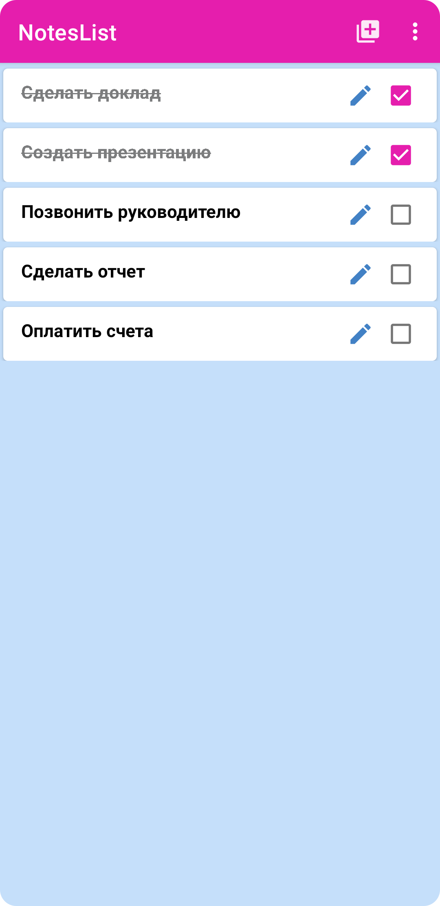 
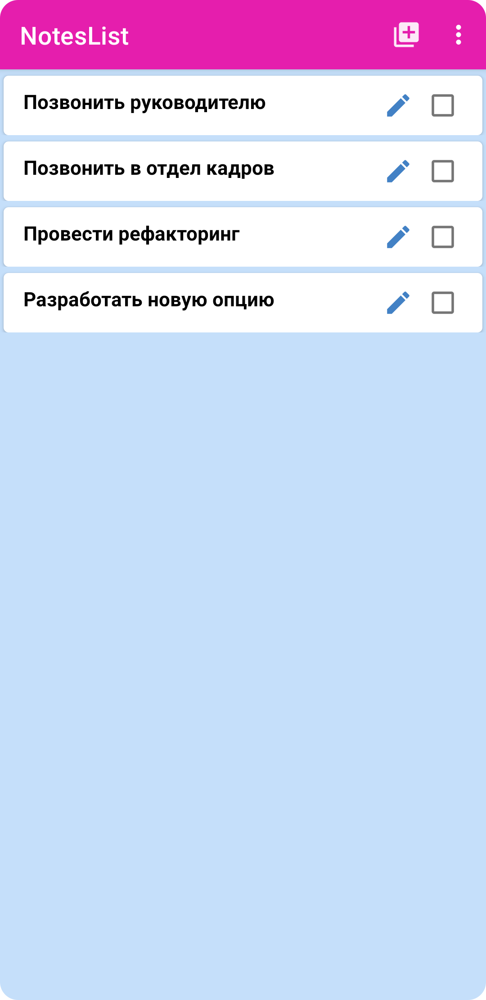        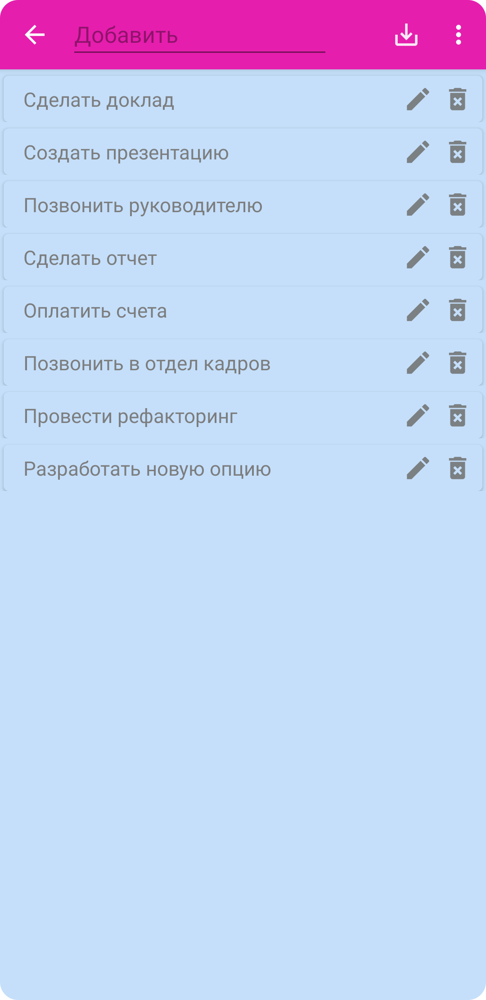 
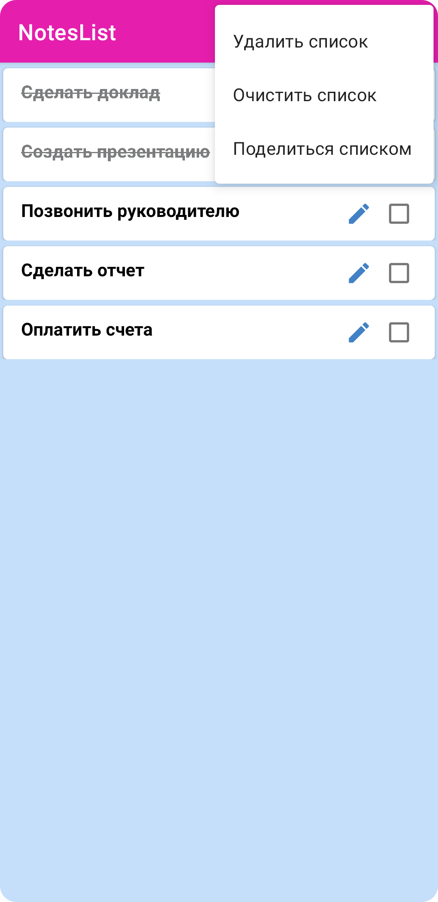        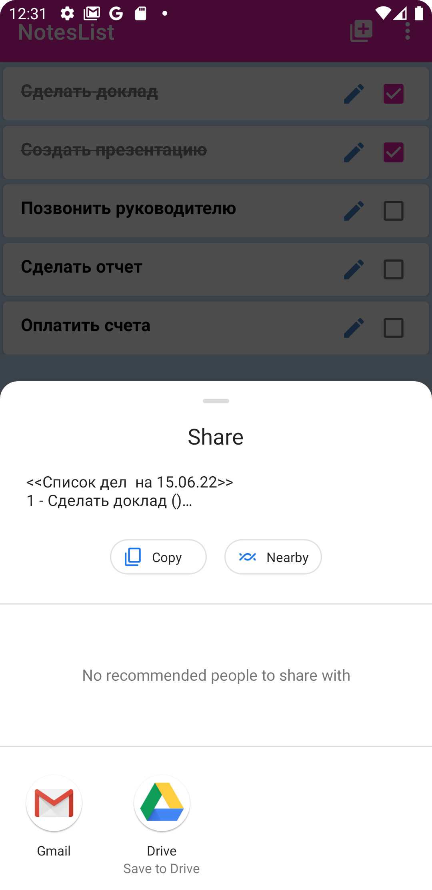 
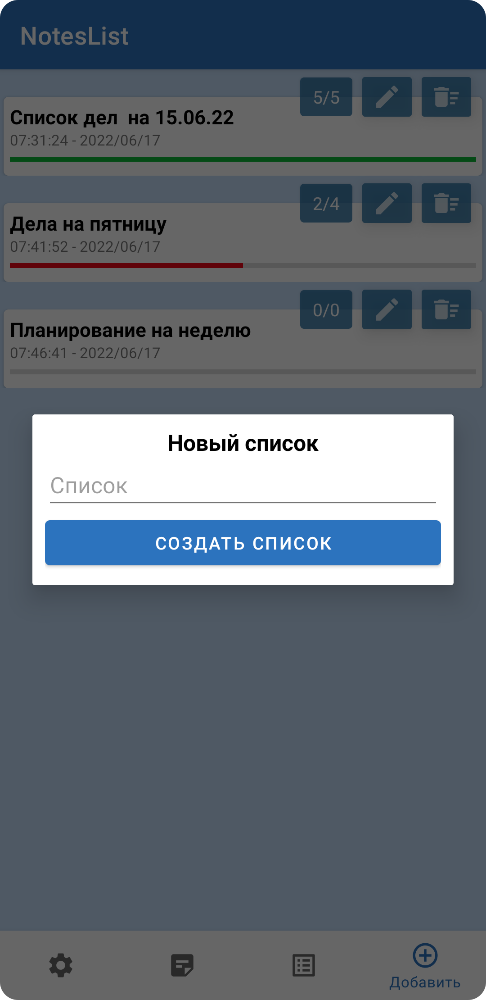        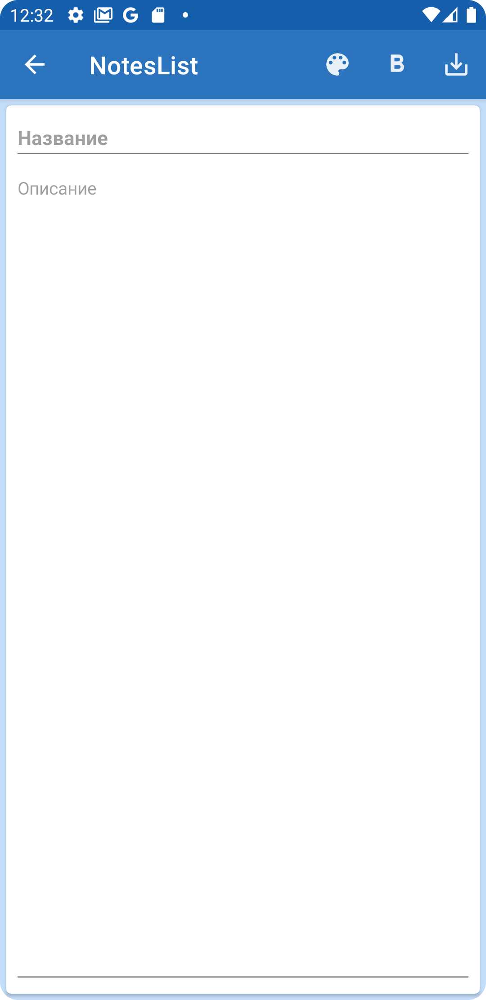 
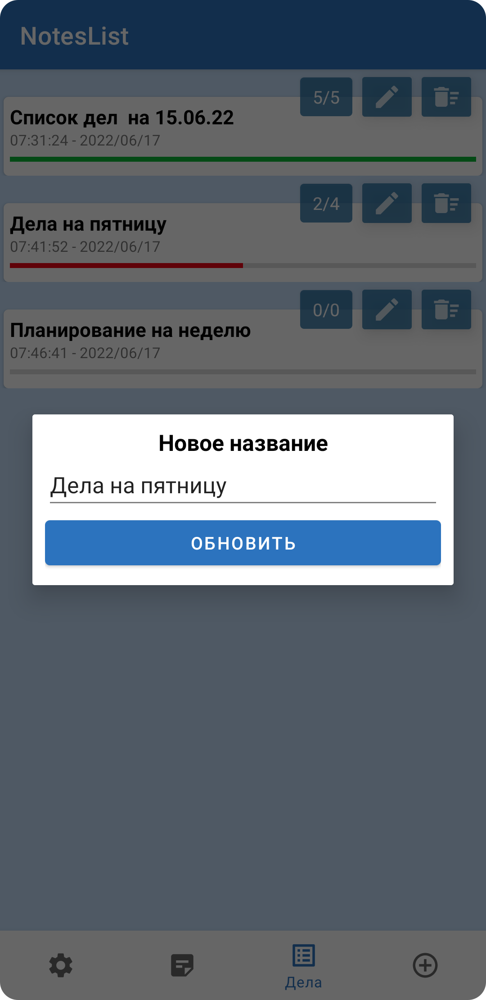        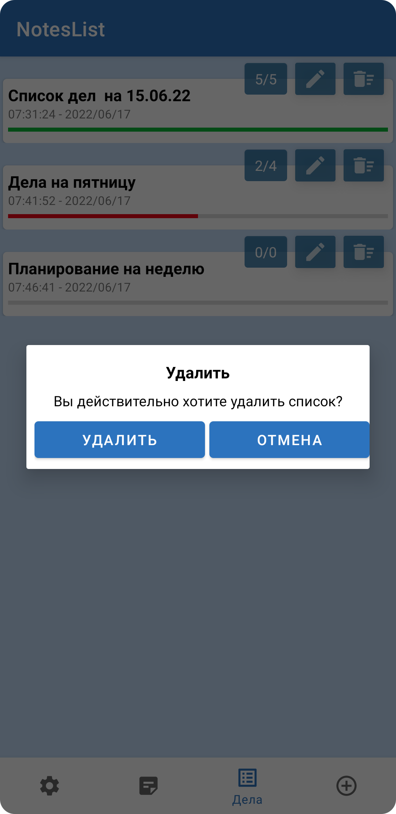 

